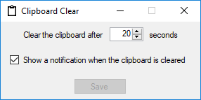

# ClipboardClear

A small app for Windows to wipe the clipboard after a set period of time to avoid pasting the wrong thing at a later time.

## Description

The app sits in the system tray and listens for any changes to the clipboard.  After the specified amount of time (from 5 to 60 seconds), the clipboard is wiped and a notification is optionally displayed to alert the user of this.  The tray icon can be used to bring up the window to change the timeout time as well as to enable / disable notifications.

    

## Attribution

All attribution for external resources may be found in the [attribution.md](attribution.md) file.
